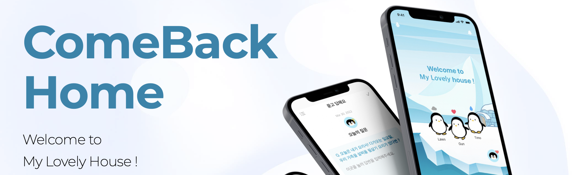

# :iphone: 컴백홈(ComeBackHome)

1. `Who` it's for
   - 거주 지역이 멀어지거나 정서적인 거리감으로 인해 소통에 어려움을 느끼는 가족들
   - 예1) 자녀가 타지역 대학교에 입학하며 자주 보지 못하고 연락도 잘되지 않는 가족
   - 예2) 대화 주제를 찾기 어렵거나 직접적으로 소통하면 쉽게 다투는 가족

2. `What` this project does (3 Solutions)
   - `묻고 답해요`: 각자 공통 질문에 답변하고 이를 공유하며 서로를 이해 
   - `오늘의 메뉴`: 서로의 식사 사진을 공유하며 '식구'라는 유대감을 유지
   - `아바타`: 소통에 지속적으로 참여했을 때 시각적인 보상을 제공하여 동기부여

## :pushpin: Features

- Fit in iPhone 13
- Live previews
- Shallow depth navigation

## :people_hugging: Authors(팀 검은국밥)

- [@김남건](https://github.com/namgeon1106) | [@남이찬](https://www.linkedin.com/in/timo-nam/) | [@박지영](https://github.com/Cap0011) | [@안다은](https://github.com/dana0315) | [@이준영](https://github.com/User-Lawn)

## :framed_picture: Demo

- [묻고 답해요](https://drive.google.com/file/d/1Si2RdRKlev2SWns-k6zz0MaYcaUc0T_R/view?usp=sharing)
- [오늘의 메뉴](https://drive.google.com/file/d/1MHexN7J1vIp_CwcXxTvw9cVM4m1J5kYG/view?usp=sharing)
- [아바타](https://drive.google.com/file/d/1yO7dmdwEKUqsQ_Wl-K_i1Yq92tuabXpL/view?usp=sharing)

## :fireworks: Screenshots

## :sparkles: Skills & Tech Stack

- `SwiftUI`
- `UIKit`

## :books: Materials

[English Presentation](https://drive.google.com/file/d/11P-YLBV6w9KYBK1vq6r5YV5zG8q9Vek5/view?usp=sharing)